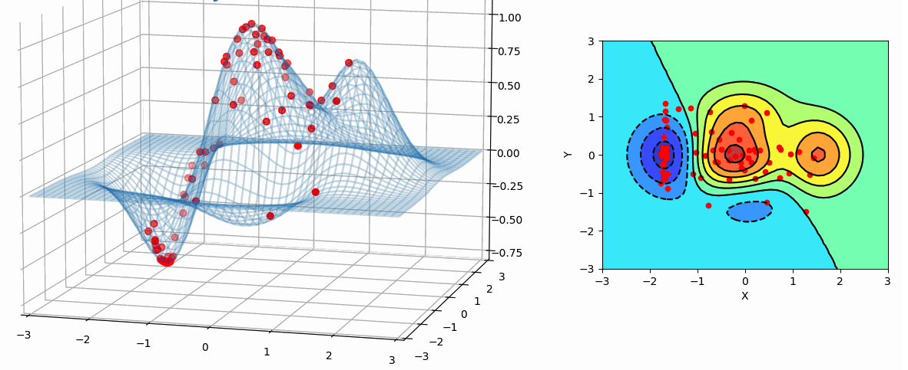
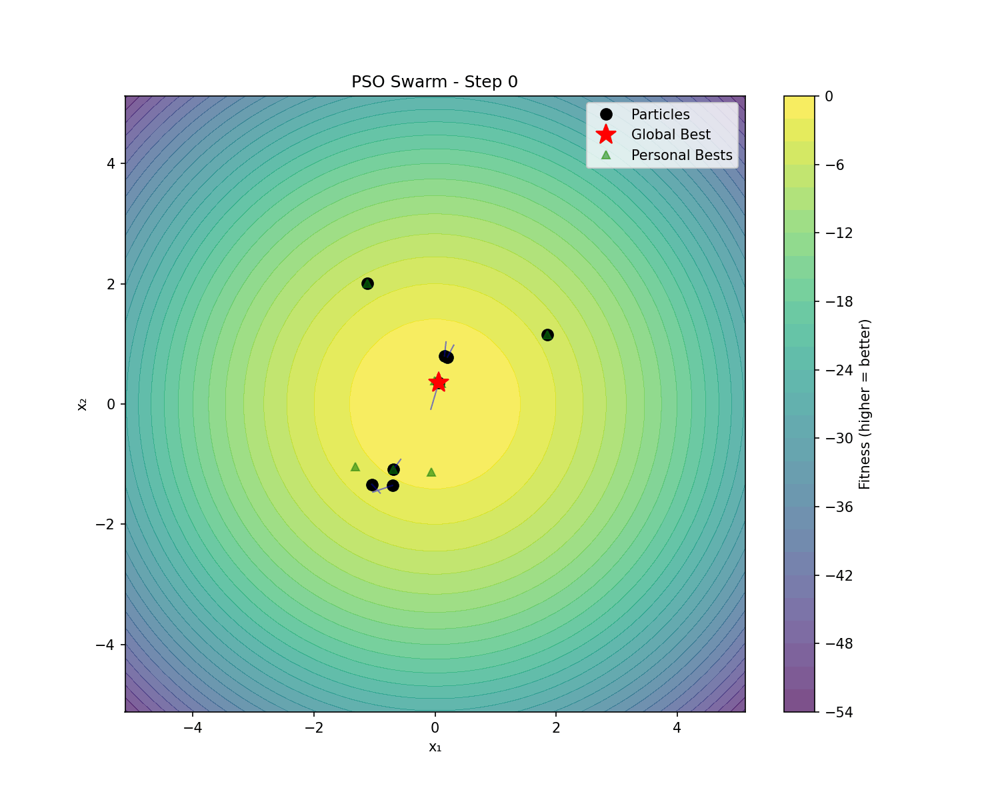
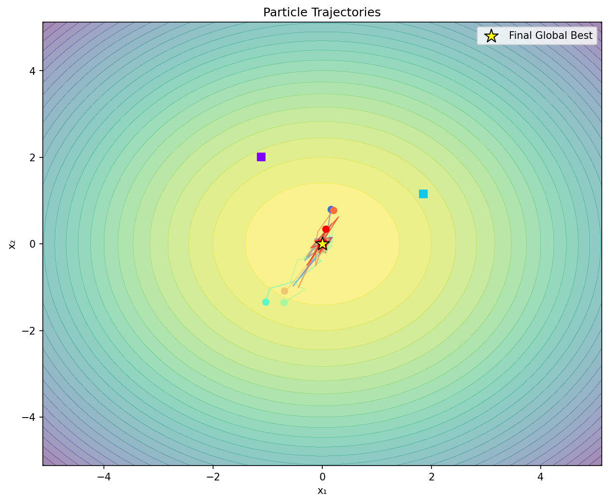
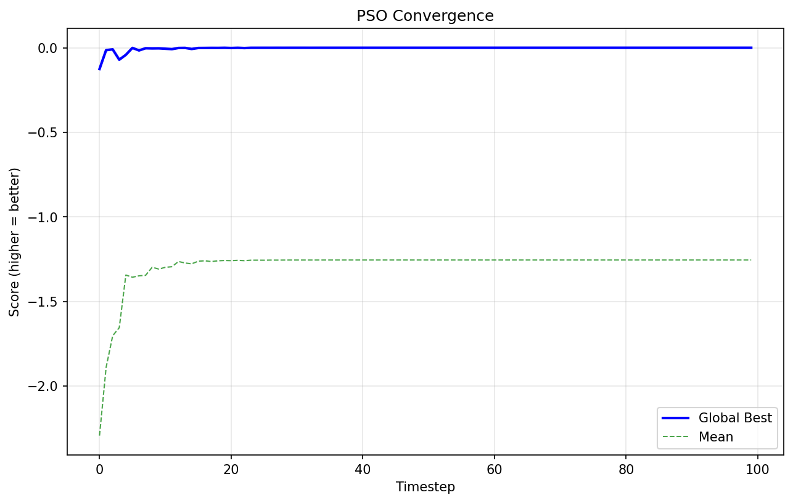
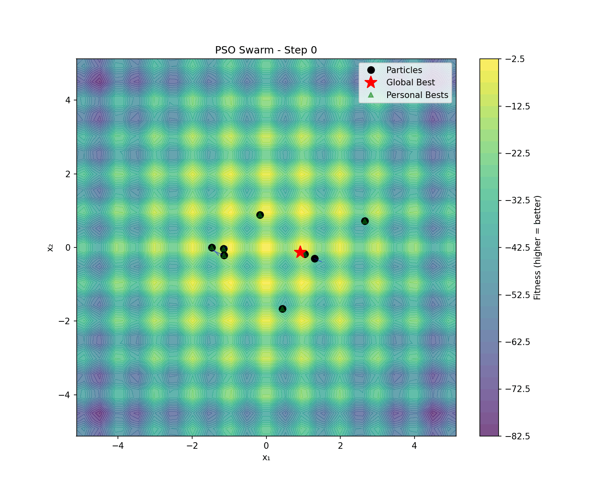
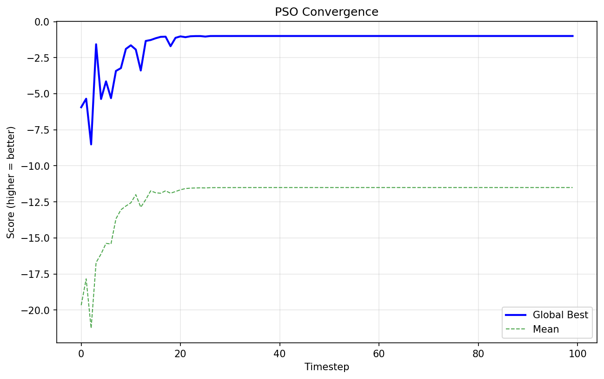
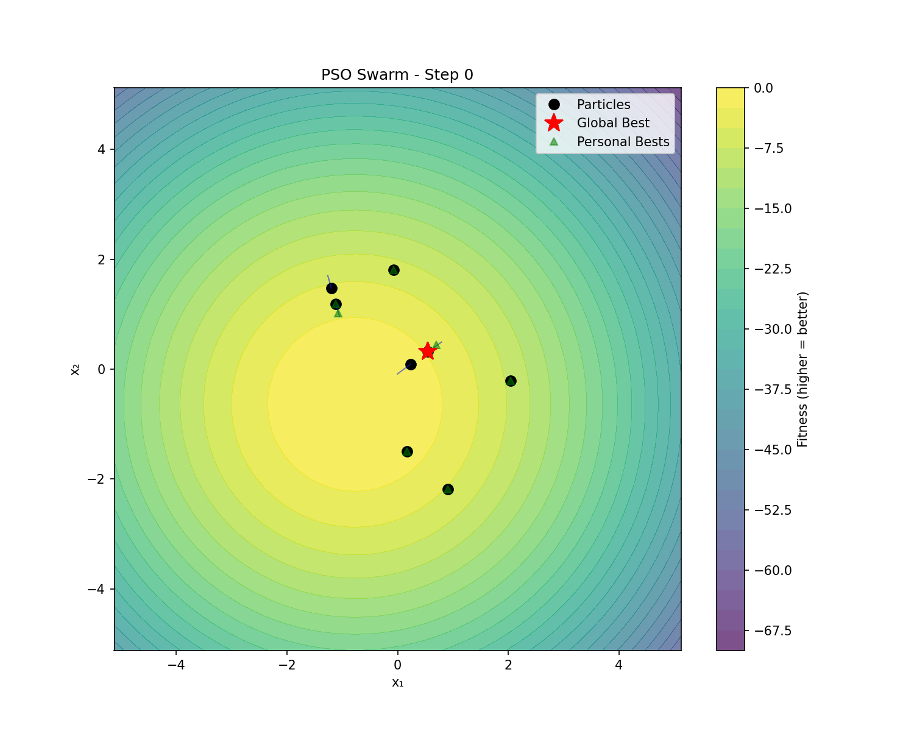

# Particle Swarm Optimization: Multi-Agent Reinforcement Learning

[](https://github.com/elte-collective-intelligence/student-particle-swarm-optimization/actions/workflows/ci.yml)
[](https://github.com/elte-collective-intelligence/student-particle-swarm-optimization/actions/workflows/docker.yml)
[](https://codecov.io/gh/elte-collective-intelligence/student-particle-swarm-optimization)
[](LICENSE)

---

**Welcome to Assignment 2!** 🎉

This is your team's codebase for exploring **Particle Swarm Optimization (PSO)** through **Multi-Agent Reinforcement Learning**. Instead of using fixed PSO parameters, you'll train agents (particles) to *learn* optimal optimization strategies through interaction and rewards. Your swarm should cooperate to find global optima while adapting to dynamic, shifting landscapes!



Don't worry if it seems complex at first, this README will walk you through everything step by step!

---

## 📋 Table of Contents

1. [What Is This Project?](#what-is-this-project)
2. [The Environment](#the-environment)
3. [Quick Start](#quick-start)
4. [Your Assignment](#your-assignment)
5. [Available Experiments](#available-experiments)
6. [Understanding the Code](#understanding-the-code)
7. [Configuration & Customization](#configuration--customization)
8. [Experimental Results](#experimental-results)
9. [Metrics & Evaluation](#metrics--evaluation)
10. [Visualization](#visualization)
11. [Troubleshooting & Tips](#troubleshooting--tips)
12. [Technical Details](#technical-details)
13. [References](#references)

---

## What Is This Project?

### The Big Picture

Imagine you're optimizing a complex function with many hills and valleys. Traditional PSO uses fixed formulas - but what if the particles could *learn* when to explore new areas vs. exploit known good regions? What if they could adapt to a landscape that changes over time?

This is **learned PSO**: each particle is an RL agent that outputs its own inertia, cognitive, and social coefficients based on what it observes.

### Particle Swarm Optimization (PSO)

- **Particles**: Agents moving through a continuous search space
- **Velocity**: Each particle has momentum, influenced by:
  - **Inertia**: How much to keep going in the same direction
  - **Cognitive**: Attraction to personal best position
  - **Social**: Attraction to neighbors' positions
- **Goal**: Find the global minimum of objective functions (Sphere, Rastrigin, etc.)

### What Makes This Interesting?

- **Learned Parameters**: Instead of fixed coefficients, agents learn optimal values
- **Multi-Agent Cooperation**: Particles share information through neighborhoods
- **Dynamic Landscapes**: Optima can move over time, requiring adaptation
- **CTDE Training**: Centralized critic for stable training, decentralized execution

### Technologies Used

- **TorchRL**: Modern RL framework for multi-agent training
- **PyTorch**: Neural network backend
- **Hydra**: Configuration management
- **Matplotlib**: Visualization and animation

---

## The Environment

### What's Going On?

The environment simulates a particle swarm optimizing a function:

```
Episode Flow:
1. Particles spawn at random positions in search space
2. Each timestep:
   - Each particle observes its state (position, velocity, bests)
   - Policy outputs PSO coefficients (inertia, cognitive, social)
   - Velocities and positions are updated
   - Fitness is evaluated on objective function
   - Personal and global bests are updated
3. Episode ends after max_steps
4. Reward based on fitness improvement
```

### What Do Agents Observe?

Each particle receives observations about its state:

| Field | Shape | Description |
|-------|-------|-------------|
| **positions** | `[agents, dim]` | Current position in search space |
| **velocities** | `[agents, dim]` | Current velocity vector |
| **scores** | `[agents]` | Current fitness value (negated, higher=better) |
| **personal_best_pos** | `[agents, dim]` | Best position found by this particle |
| **personal_best_scores** | `[agents]` | Fitness at personal best |
| **avg_pos** | `[agents, dim]` | Mean position of neighbors within δ radius |
| **avg_vel** | `[agents, dim]` | Mean velocity of neighbors within δ radius |

### What Do Agents Output?

Each particle outputs 3 coefficient vectors:

| Action | Shape | Description | Typical Range |
|--------|-------|-------------|---------------|
| **inertia** | `[agents, dim]` | Weight for previous velocity | 0.3 - 1.1 |
| **cognitive** | `[agents, dim]` | Weight for personal best attraction | 0.5 - 2.5 |
| **social** | `[agents, dim]` | Weight for social/neighbor attraction | 0.5 - 2.5 |

### The PSO Update Equations

```python
velocity = inertia * velocity 
         + cognitive * (personal_best_pos - position)
         + social * avg_neighbor_pos

position = position + velocity
```

### How Do Agents Learn?

We use **PPO (Proximal Policy Optimization)** with:

- **Centralized Critic**: Sees all particles' states during training
- **Decentralized Actors**: Each particle acts on its own observations
- **Shared Parameters**: All particles share the same policy network
- **GAE**: Generalized Advantage Estimation for stable learning

---

## Quick Start

### Prerequisites

- **Docker** (recommended) OR Python 3.12+
- **GPU** (optional but faster)
- **~2GB disk space** for Docker image

### 🚀 30-Second Quickstart

```bash
# 1. Clone the repo
git clone https://github.com/elte-collective-intelligence/student-particle-swarm-optimization.git
cd student-particle-swarm-optimization

# 2. Build Docker image (one-time setup, ~3 minutes)
docker build -f docker/Dockerfile -t student_pso .

# 3. Run a quick training experiment (~1 minute)
docker run --rm --gpus=all \
  -v $(pwd):/app \
  student_pso \
  python src/main.py --config-path configs/experiments --config-name smoke_train
```

If you see training logs and "Training Complete!", you're good to go! 🎉

### What Just Happened?

The `smoke_train` experiment:
- Created a 2D sphere function landscape
- Spawned 5 particles
- Trained for 10 iterations (~5k frames)
- Saved results to `src/outputs/smoke_train/`

### Local Development (Without Docker)

```bash
# Install dependencies
pip install -r requirements.txt

# Run experiment locally
python src/main.py --config-path configs/experiments --config-name smoke_train

# Or use the script
./scripts/run_experiment.sh smoke_train
```

### Verify Everything Works

```bash
# Run tests (23 tests, should all pass)
pytest test/ -v

# Quick training check
python src/main.py n_iters=5 frames_per_batch=256
```

---

## Your Assignment

### Overview

Each team will receive a specific task focusing on different aspects of the PSO system. Your task will involve:

1. **Implementing** a specific feature or modification
2. **Running experiments** to evaluate your changes
3. **Analyzing results** with ablation studies
4. **Writing a report** documenting your findings

### Key Areas to Explore

- **Reward Shaping**: Design rewards for diversity, anti-collapse, exploration
- **Dynamic Landscapes**: Adapt to moving optima
- **Communication Topologies**: Compare gBest vs lBest neighborhoods
- **Role Emergence**: Do particles specialize (scouts vs exploiters)?
- **Curriculum Learning**: Easy → hard functions, low → high dimensions

---

## Available Experiments

The codebase comes with pre-configured experiments. Start with `smoke_train`, then customize.

### Experiment Configurations

| Name | Agents | Dims | Function | Iterations | Purpose |
|------|--------|------|----------|------------|---------|
| `smoke_train` | 5 | 2D | sphere | 10 | Quick sanity check (~1 min) |
| `full_train` | 20 | 5D | sphere | 100 | Full training (~10 min) |
| `rastrigin_train` | 10 | 2D | rastrigin | 50 | Multimodal function |
| `dynamic_train` | 10 | 2D | dynamic_sphere | 50 | Moving optimum |
| `eval_vis` | 10 | 2D | sphere | - | Visualization only |

### Running Experiments

**With Docker:**
```bash
docker run --rm --gpus=all \
  -v $(pwd):/app \
  student_pso \
  python src/main.py --config-path configs/experiments --config-name smoke_train
```

**With Scripts:**
```bash
# Single experiment
./scripts/run_experiment.sh smoke_train

# All experiments
./scripts/train_all.sh
```

**Locally:**
```bash
python src/main.py --config-path configs/experiments --config-name smoke_train
```

### Where Are Results Saved?

```
src/outputs/<experiment_name>/
├── training_results.png     # Training curves
├── policy.pt                # Saved policy network
├── critic.pt                # Saved critic network
└── .hydra/                  # Hydra config logs
```

---

## Understanding the Code

### Project Structure

```
student-particle-swarm-optimization/
├── src/
│   ├── main.py                      # Training entry point (START HERE)
│   ├── eval.py                      # Evaluation & visualization script
│   ├── visualization.py             # 2D/3D swarm animations (427 lines)
│   ├── utils.py                     # Wrappers & action extraction
│   ├── README.md                    # 📖 Source code overview
│   ├── envs/
│   │   ├── README.md                # 📖 Environment documentation
│   │   ├── env.py                   # PSO environment (241 lines)
│   │   └── dynamic_functions.py     # Dynamic landscapes (188 lines)
│   └── configs/
│       ├── README.md                # 📖 Configuration guide
│       ├── config.yaml              # Default training config
│       ├── eval_config.yaml         # Evaluation config
│       ├── env/                     # Environment settings
│       ├── model/                   # PPO hyperparameters
│       ├── experiments/             # Pre-defined experiments
│       └── visualization/           # Visualization options
├── test/
│   ├── README.md                    # 📖 Test documentation
│   └── test_env.py                  # Environment tests (23 tests)
├── scripts/
│   ├── README.md                    # 📖 Scripts documentation
│   ├── run_experiment.sh            # Run single experiment
│   ├── train_all.sh                 # Run all training
│   └── eval_model.sh                # Evaluate trained model
├── docker/
│   └── Dockerfile                   # Docker container
├── images/                          # Training result plots
├── requirements.txt                 # Python dependencies
└── README.md                        # You are here!
```

**📚 Every directory has a comprehensive README!** Each explains:
- What each file does
- How components interact
- Usage examples
- Tips for students

### Key Files to Understand

**For most assignments, you'll primarily work with:**

1. **`src/envs/env.py`** (PSO Environment)
   - Particle dynamics and state updates
   - Neighborhood calculations
   - Reward computation
   - **Read `src/envs/README.md` for details**

2. **`src/main.py`** (Training Loop)
   - PPO training with GAE
   - Action transformation for proper PSO ranges
   - Model saving and logging

3. **`src/utils.py`** (Utilities)
   - `PSOActionExtractor`: Transforms network outputs to PSO coefficients
   - `LandscapeWrapper`: Wraps objective functions

4. **`src/visualization.py`** (Visualization)
   - 2D/3D animated swarm visualizations
   - Trajectory and convergence plots

### Code Flow: How Training Works

```
main.py
  ↓
1. Load config from Hydra
  ↓
2. Create environment (PSOEnv)
  ↓
3. Initialize policy & critic (MultiAgentMLP)
  ↓
4. For each iteration:
    ↓
    env.rollout() → collect trajectories
    ↓
    compute_gae() → compute advantages
    ↓
    For each epoch:
      ↓
      PPO update (clip loss + value loss)
    ↓
    Log metrics (reward, loss)
  ↓
5. Save models to outputs/
```

---

## Configuration & Customization

### Main Config Structure

```yaml
# src/configs/config.yaml

model:
  name: ppo
  hidden_sizes: [64, 64]
  activation: relu
  learning_rate: 0.0003
  centralized_critic: true
  share_params: true

env:
  name: swarm
  landscape_dim: 2
  num_agents: 10
  batch_size: 8
  delta: 1.0                    # Neighborhood radius
  landscape_function: sphere

# Training settings
frames_per_batch: 4096
minibatch_size: 256
n_iters: 100
num_epochs: 4
clip_epsilon: 0.2
entropy_coef: 0.01
gamma: 0.99
lmbda: 0.95

# Output
output_dir: src/outputs/default
save_model: true
save_plot: true
```

### Creating Your Own Experiment

```bash
# 1. Create a new config file
cat > src/configs/experiments/my_experiment.yaml << EOF
defaults:
  - ../config
  - _self_

env:
  num_agents: 20
  landscape_function: rastrigin
  landscape_dim: 5

n_iters: 100
output_dir: src/outputs/my_experiment
EOF

# 2. Run it!
python src/main.py --config-path configs/experiments --config-name my_experiment
```

### Key Parameters to Tune

| Parameter | Effect | Recommendation |
|-----------|--------|----------------|
| `env.num_agents` | More particles = better exploration | 10-50 |
| `env.delta` | Neighborhood radius | 0.5-2.0 |
| `model.hidden_sizes` | Network capacity | [64,64] or [128,128] |
| `clip_epsilon` | PPO conservatism | 0.1-0.3 |
| `entropy_coef` | Exploration bonus | 0.01-0.1 |

---

## Experimental Results

Evaluation was conducted on various benchmark functions. Below are animated visualizations showing particle swarm behavior and evaluation metrics.

### Evaluation Metrics Summary

| Landscape | Agents | Dims | Best Score | Final Score | Vs Random |
|-----------|--------|------|------------|-------------|-----------|
| **Sphere** | 10 | 2D | -0.085 | -0.085 ± 0.17 | ✅ Converges to optimum |
| **Rastrigin** | 10 | 2D | -0.716 | -7.64 ± 5.63 | ✅ Navigates local minima |
| **Dynamic Sphere** | 10 | 2D | -0.004 | -1.82 ± 1.21 | ✅ Tracks moving target |

*Note: Scores are negated (higher = better). Best score shows optimal value found.*

---

### Sphere Function (Unimodal)

The simplest test function - particles should converge quickly to the origin.

<table>
<tr>
<td width="50%">

**2D Swarm Animation**



</td>
<td width="50%">

**3D Surface View**


</td>
</tr>
</table>

<table>
<tr>
<td width="50%">

**Particle Trajectories**



</td>
<td width="50%">

**Convergence Plot**



</td>
</tr>
</table>

**Observations:**
- Particles quickly identify the global optimum at origin
- Velocities decrease as swarm converges
- Final best score approaches 0 (perfect)

---

### Rastrigin Function (Multimodal)

A challenging function with many local minima - tests exploration vs exploitation.

<table>
<tr>
<td width="50%">

**2D Swarm Animation**



</td>
<td width="50%">

**Convergence Plot**



</td>
</tr>
</table>

**Observations:**
- Particles explore multiple basins before settling
- Some particles get trapped in local minima
- Learned coefficients help escape local optima better than fixed PSO

---

### Dynamic Sphere (Moving Optimum)

The optimum moves in a circular path - tests adaptive tracking.

**2D Swarm Animation**



**Observations:**
- Swarm tracks the moving optimum (circular trajectory)
- Agents maintain exploration to avoid losing the target
- Demonstrates adaptation to non-stationary environments

---

### Key Insights

1. **Action Transformation is Critical**: Raw network outputs (~0) don't work for PSO. We transform to proper ranges:
   - Inertia: `0.7 + 0.2 * tanh(x)` → [0.5, 0.9]
   - Cognitive/Social: `1.5 + 0.5 * tanh(x)` → [1.0, 2.0]

2. **Neighborhood Information**: The `delta` parameter controls local vs global information sharing.

3. **Dynamic Adaptation**: On moving landscapes, agents learn to maintain exploration rather than converging prematurely.

---

## Metrics & Evaluation

### Core Metrics

#### 1. 📊 Fitness Improvement (Reward)

**What it measures**: How much the swarm improves each step

```python
reward = current_score - previous_score
# Higher is better (we negate functions, so minimization → maximization)
```

#### 2. 🎯 Best Fitness Found

**What it measures**: Quality of the best solution found

```python
best_fitness = max(global_best_score over episode)
```

#### 3. 🌐 Swarm Diversity

**What it measures**: How spread out the particles are

```python
diversity = mean_pairwise_distance(positions)
# Low diversity = premature convergence risk
```

### Running Evaluation

```bash
# Evaluate a trained model
python src/eval.py model_path=src/outputs/sphere_full/policy.pt

# With visualization
python src/eval.py model_path=src/outputs/sphere_full/policy.pt \
    visualization.visualize_swarm=true \
    visualization.save_gif=true
```

---

## Visualization

The visualization module creates animated views of swarm behavior.

### 2D Animation
Shows particles on landscape contours with:
- Particle positions (colored dots)
- Velocity vectors (arrows)
- Personal bests (small markers)
- Global best (star)

### 3D Animation
For 2D search spaces, shows particles on the 3D surface with rotating camera.

### Trajectory Plot
Static plot showing paths each particle took during optimization.

### Convergence Plot
Best and mean fitness over time.

### Generating Visualizations

```bash
python src/eval.py model_path=src/outputs/sphere_full/policy.pt \
    visualization.visualize_swarm=true \
    visualization.save_gif=true \
    visualization.save_dir=src/outputs/vis/
```

---

## Troubleshooting & Tips

### Common Issues

#### Training doesn't learn (rewards stay ~0)
- **Cause**: Network outputs are near 0, but PSO needs specific coefficient ranges
- **Solution**: Ensure `transform_actions=True` in `PSOActionExtractor`

#### CUDA out of memory
- Reduce `frames_per_batch` or `env.batch_size`
- Use smaller `model.hidden_sizes`

#### Particles explode (positions go to infinity)
- Reduce learning rate
- Check velocity clamping in environment
- Use gradient clipping (`max_grad_norm`)

#### Poor performance on multimodal functions
- Increase `entropy_coef` for more exploration
- Use more particles (`env.num_agents`)
- Try larger `env.delta` for more information sharing

### Tips for Better Results

1. **Start Simple**: Test on `sphere` before `rastrigin`
2. **Watch Training Curves**: Reward should trend upward
3. **Check Diversity**: If particles collapse to one point, add diversity reward
4. **Tune Carefully**: Small changes to `clip_epsilon` and `entropy_coef` matter

---

## Technical Details

### Landscape Functions

| Function | Formula | Optimum | Difficulty |
|----------|---------|---------|------------|
| `sphere` | `f(x) = Σ x_i²` | f(0) = 0 | Easy |
| `rastrigin` | `f(x) = 10n + Σ[x_i² - 10cos(2πx_i)]` | f(0) = 0 | Hard |
| `eggholder` | Complex (see code) | Known | Hard |
| `dynamic_sphere` | Sphere with moving center | Tracks | Medium |
| `dynamic_rastrigin` | Rastrigin with oscillating amplitude | Adapts | Very Hard |

### PPO Implementation Details

- **Clipped Objective**: `min(r*A, clip(r, 1-ε, 1+ε)*A)`
- **Value Loss**: MSE between predicted and GAE-computed returns
- **Entropy Bonus**: Encourages exploration
- **Gradient Clipping**: `max_grad_norm=0.5`

### Neighborhood Calculation

```python
def get_neighborhood_avg(positions, velocities, delta):
    # Compute pairwise distances
    dist = pairwise_distance(positions)
    
    # Mask for neighbors within delta
    neighbor_mask = (dist <= delta)
    
    # Average position/velocity of neighbors
    avg_pos = masked_mean(positions, neighbor_mask)
    avg_vel = masked_mean(velocities, neighbor_mask)
    
    return avg_pos, avg_vel
```

---

## References

### PSO Papers
- Kennedy & Eberhart (1995) - Original PSO
- Shi & Eberhart (1998) - Inertia weight

### RL Papers
- Schulman et al. (2017) - [PPO](https://arxiv.org/abs/1707.06347)
- Lowe et al. (2017) - [MADDPG](https://arxiv.org/abs/1706.02275)

### Dynamic Optimization
- Blackwell (2007) - Dynamic PSO

---

## Tests

```bash
# Run all tests (23 tests)
pytest test/ -v

# Run with coverage
pytest test/ --cov=src --cov-report=html

# Quick check
pytest test/test_env.py -v -x
```

## Docker

```bash
# Build image
docker build -f docker/Dockerfile -t student_pso .

# Run training
docker run --rm --gpus=all -v $(pwd):/app student_pso \
    python src/main.py --config-path configs/experiments --config-name smoke_train

# Interactive shell
docker run --rm -it --gpus=all -v $(pwd):/app student_pso bash
```

---

## License

This project is licensed under CC BY-NC-ND 4.0. See [LICENSE](LICENSE) for details.

---

**Happy optimizing!** 🎯✨

If you have questions, check the README files in each subdirectory or ask your instructor.
